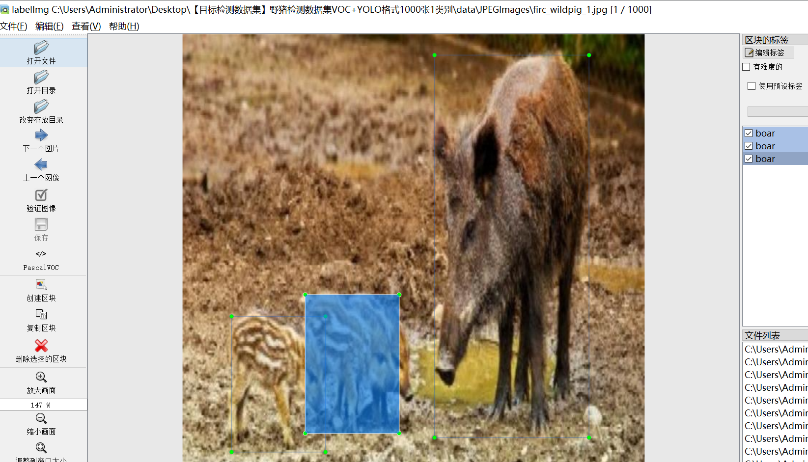
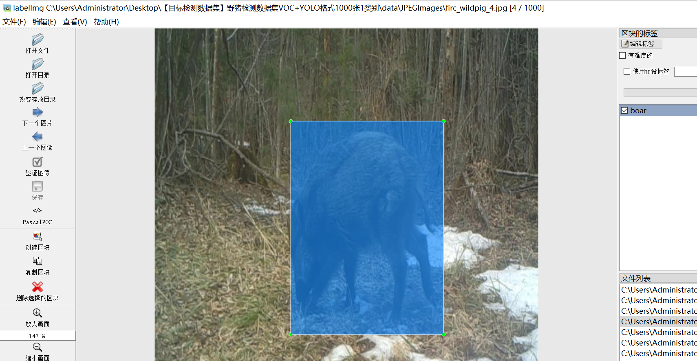
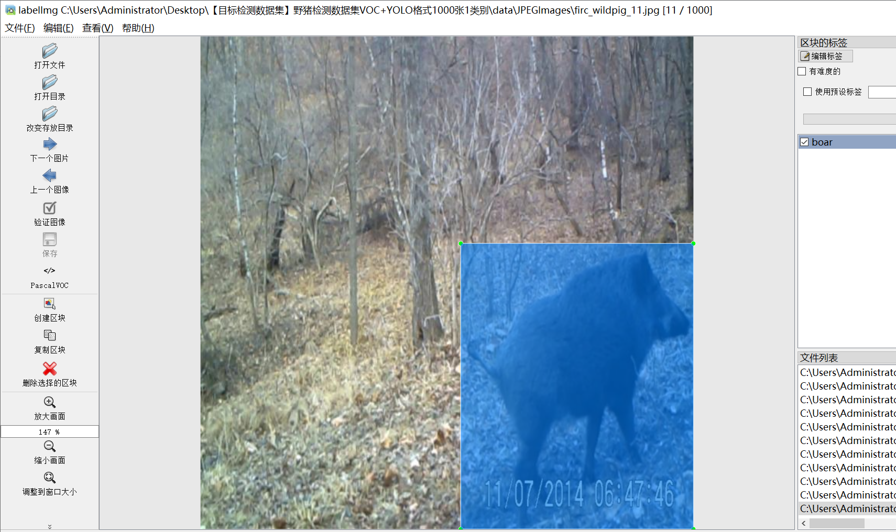
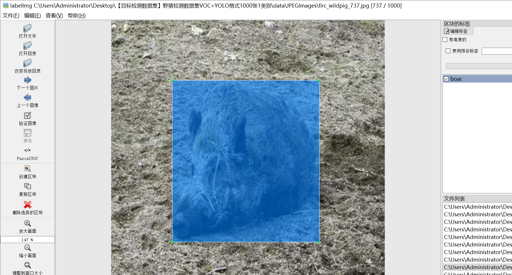
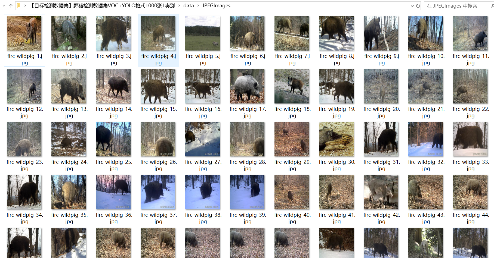
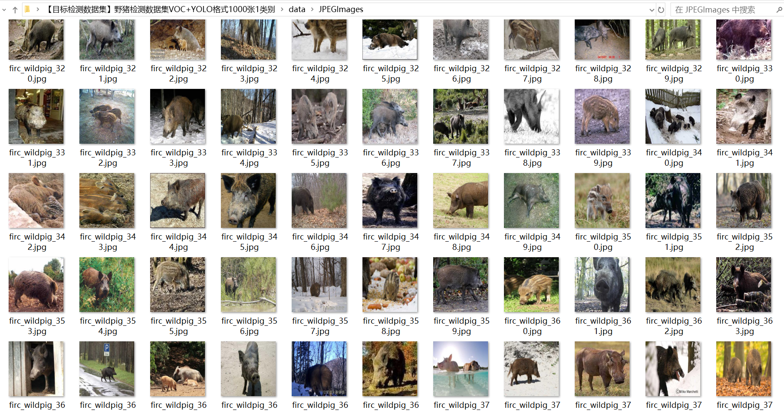

# [Object Detection Dataset] Rustic Pig Detection Dataset VOC+YOLO format1000 images1-class

Dataset Description: ~

Dataset format: Pascal VOC format + YOLO format (the txt file does not contain the split path, it only contains jpg images and corresponding VOC format xml files and yolo format txt files)

Number of jpg files: 1000

Number of xml files: 1000

Number of txt files: 1000

Number of categories: 1

Annotation class names: ["boar"]

Number of boxes labeled in each category:

boar frame count = 1266

Total boxes: 1266

Use the labeling tool: labelImg

Rules for annotation: Draw a rectangle around the category.

## Images

---

Here is a pay link on Stripe (https://buy.stripe.com/3cs8yP7sY87d0vu9AB). Please contact me lonlonago@foxmail.com after funding $89, and I will send you a complete data files, thank you!

